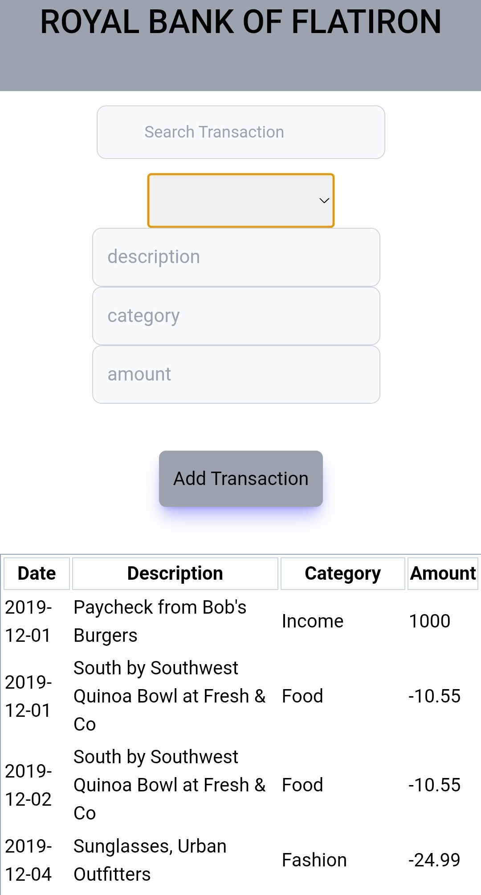

# Bank of Flatiron
# Description
The code challenge entailed getting Bank of Flatiron's transactional data from a json file  and using the React Library to display the data. The constituents of the application include a search bar where the user can input information and the transactions will be filtered based on the input. The user is able to add their own financial transactional data which is inturn persistently added to the db.json file. The application is built upon the [react](https://reactjs.org/) library

# Getting Started
In order to be able to use this particular repository one needs to have the following:

- A computer that runs either on: (Windows 7+, Linux, Mac OS).
- A little bit of patience.

# Installation
To be able to use the code in your machine one needs to:
- Open the terminal on your computer
- Clone the repo by using the following:

        git clone git@github.com:MathaiMarvin Bank-of-Flatiron-wk1-code-challenge.git

- Change directory to the repository folder:

        cd Bank-of-Flatiron-wk1-code-challenge.

- Open code in text editor:

        code .
- Ensure that JSON server is installed in your machine:

          npm install -g json-server

# Running Application

